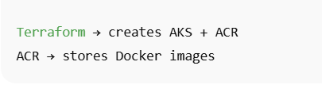

## Running Pods Verification

The screenshot below confirms that backend and PostgreSQL pods are successfully running inside the AKS cluster.

---

## Architecture Diagram

---

## Project Architecture

