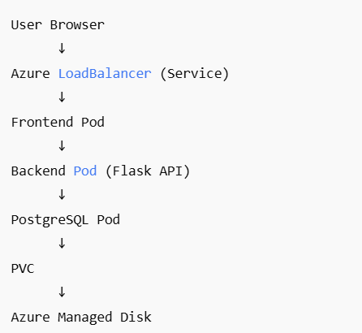

# Deployment Verification

## Running Pods

Below shows all application pods running successfully in AKS.




---

## Pod Details

### Backend Pod
- Status: Running
- Handles API and database connection

### PostgreSQL Pod
- Status: Running
- Uses Persistent Volume Claim for storage

---

## Services Verification

### Backend LoadBalancer Service
- Exposes application externally
- Accessible via public IP

Example:

```
http://20.116.241.112/
```

### Database Service
- ClusterIP internal service
- Accessible only within cluster

---

## Database Connectivity Test

Backend successfully connects to PostgreSQL using environment variables and Kubernetes Secret.

Example endpoint:

```
http://20.116.241.112/db
```

---

## Storage Verification

PostgreSQL is using:

- Persistent Volume Claim
- Azure Managed Disk
- StorageClass: managed-csi

---

## Infrastructure Summary

| Component | Technology |
|-----------|------------|
| Container Runtime | Docker |
| Registry | Azure Container Registry |
| Orchestration | Azure Kubernetes Service |
| Database | PostgreSQL |
| Infrastructure | Terraform |
| Storage | Azure Managed Disk |

---

## Deployment Status

✅ Backend Running  
✅ Database Running  
✅ Services Exposed  
✅ Storage Bound  
✅ Database Connectivity Working  

---

## Notes

LoadBalancer public IP may change if service is recreated.
